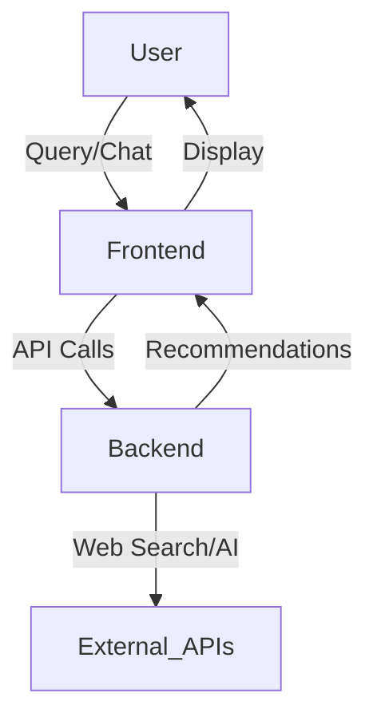

# Redmerce - LLM & Beyond Seminar Platform

A modern e-commerce product recommendation platform leveraging AI agents (smolagents), Perplexity API, and OpenAI GPT models to provide intelligent, real-time product suggestions and conversational shopping experiences.

---

## 🚀 Features

- **AI-Powered Product Search**: Uses smolagents for intelligent reasoning and planning
- **Real-Time Web Search**: Perplexity API integration for live product data
- **LLM-Powered Extraction**: OpenAI GPT models for product information extraction
- **Smart Filtering**: Filter by price, features, and brand
- **Relevance Ranking**: AI-powered product ranking
- **Conversational Chat**: Natural language follow-up and refinement
- **Saved Items**: Save products for later viewing
- **Trusted Sources**: Curated e-commerce domains

---

## 🏗️ Architecture Overview

- **Frontend**: React (Material UI), provides chat, product recommendations, and saved items management
- **Backend**: Flask, exposes RESTful API, integrates smolagents, Perplexity, and OpenAI

### Data Flow



---

## 🛠️ Installation

### Prerequisites
- Python 3.8+
- Node.js 16+
- OpenAI API key
- Perplexity API key

### Backend Setup
```bash
cd backend
python -m venv venv
source venv/bin/activate
pip install -r requirements.txt
cp env.example .env  # Add your API keys to .env
```

### Frontend Setup
```bash
cd frontend
npm install
```

---

## 🚦 Usage

### Start the Application
```bash
./start.sh  # Starts both backend and frontend
```
Or manually:
```bash
# Terminal 1
cd backend && python run.py
# Terminal 2
cd frontend && npm start
```

---

## 🧩 API Endpoints (Backend)
- `POST /api/chat` - Agent Interface
- `GET /health` - Health check

---

## 🖥️ Frontend Features
- **Home Page**: Entry point, product search
- **Chat Page**: Conversational product refinement
- **Saved Items**: View and manage saved products
- **Material UI**: Modern, responsive design
- **Persistent Storage**: Saved items stored in browser

---

## 🧠 Backend Features
- **AI Agent Orchestration**: smolagents for reasoning
- **Web Search**: Perplexity API for real-time data
- **Product Analysis**: OpenAI GPT for extraction
- **Product Extraction**: SerpAPI to find real product links

---

## 🗂️ Project Structure
```
redmerce/
├── frontend/         # React frontend
│   ├── src/
│   │   ├── components/  # Chat, ProductRecommendation, SavedItems, etc.
│   │   └── App.js
│   └── package.json
├── backend/          # Flask backend
│   ├── services/     # agent_service.py,
│   ├── utils/        # error_handler.py, validators.py
│   ├── app.py
│   ├── run.py
│   └── requirements.txt
├── start.sh          # Startup script
└── README.md         # This file
```

---

## 🧪 Testing

### Backend
```bash
curl http://localhost:5001/health
curl -X POST http://localhost:5001/api/search -H "Content-Type: application/json" -d '{"query": "Samsung 4K TV"}'
```

### Frontend
Start both services and test via browser at [http://localhost:3000](http://localhost:3000)

---

## 🔍 Example Usage

**Product Search:**
```bash
curl -X POST http://localhost:5001/api/search -H "Content-Type: application/json" -d '{"query": "Samsung 4K TV"}'
```

**Chat Follow-up:**
```bash
curl -X POST http://localhost:5001/api/chat -H "Content-Type: application/json" -d '{"message": "Show me cheaper alternatives"}'
```

---

## 🤝 Contributing
1. Fork the repository
2. Create a feature branch
3. Make your changes (with comments!)
4. Add tests if possible
5. Submit a pull request

---

## 📄 License
MIT License (see LICENSE)

---

## 🙏 Acknowledgments
- Smolagents (AI agent framework)
- Perplexity (web search)
- OpenAI (GPT models)
- Flask (backend)
- Material UI (frontend) 